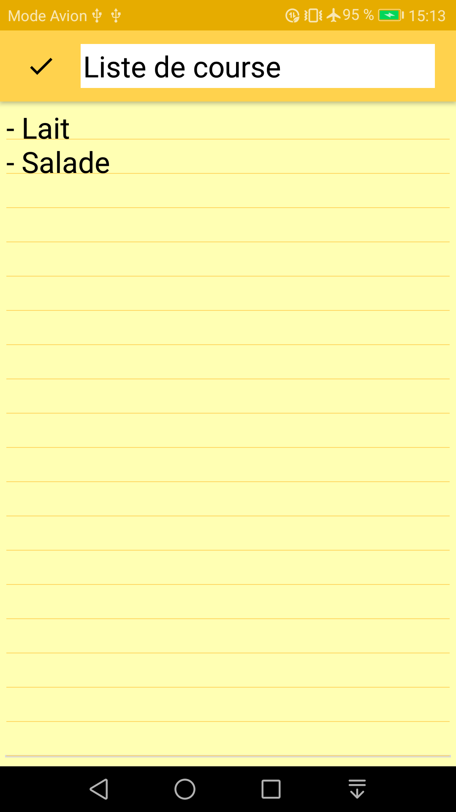
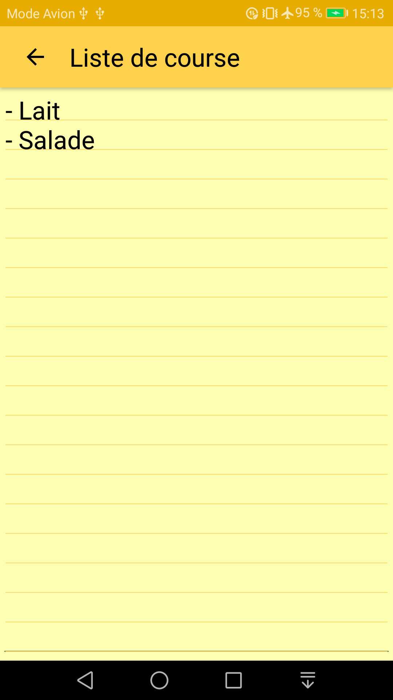
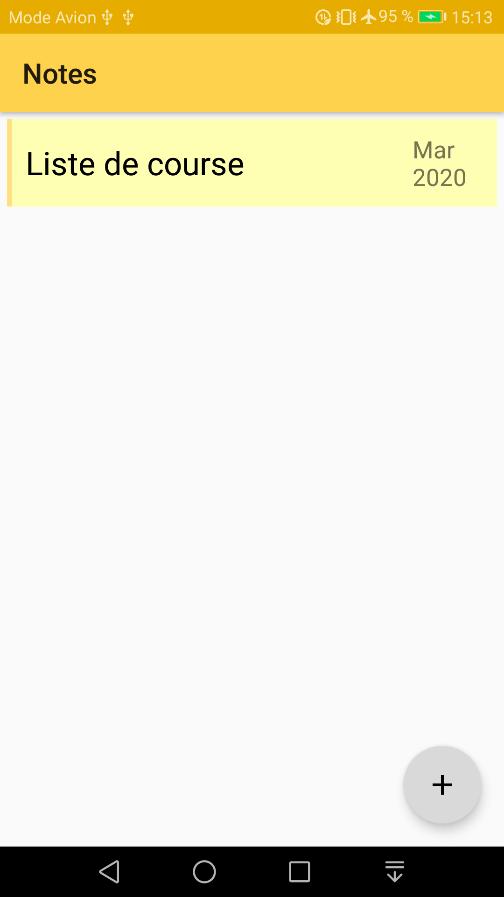
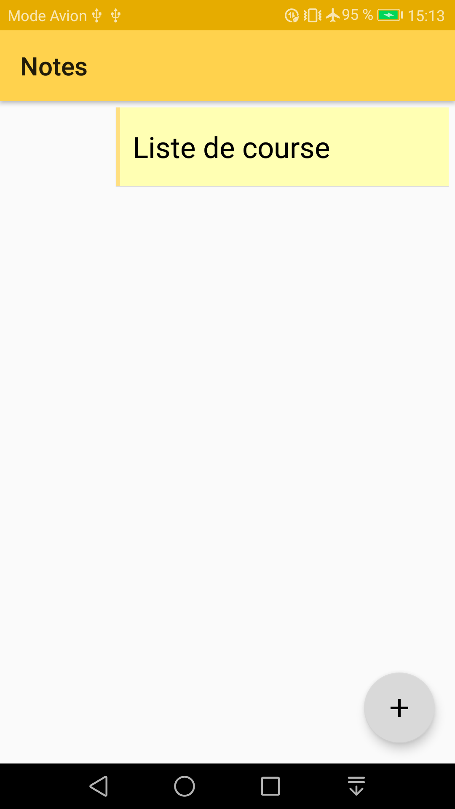

# Notes
Application de prise de note

Concepts mis en oeuvre :
- Room
- Repository
- LiveData
- AsyncTask
- RecycleView avec Adapter customisé
- Swipe delete
- ToolBar
- OnDoubleTapListener
## Prérequis
- Android Studio
## Installation
Télécharger le .zip du projet, extraire le contenu dans le répertoire de votre choix et ouvrir ce répertoire dans Android Studio.
## Version SDK
- minSdkVersion : **21**  
- targetSdkVersion : **28**
## Librairies utilisées
RecyclerView
- implementation 'com.android.support:recyclerview-v7:28.0.0'

design support library (for toolbars)
- implementation 'com.android.support:design:28.0.0'

Room
- implementation "androidx.room:room-runtime:2.2.4"
- annotationProcessor "androidx.room:room-compiler:2.2.4"

## Captures d'écran

